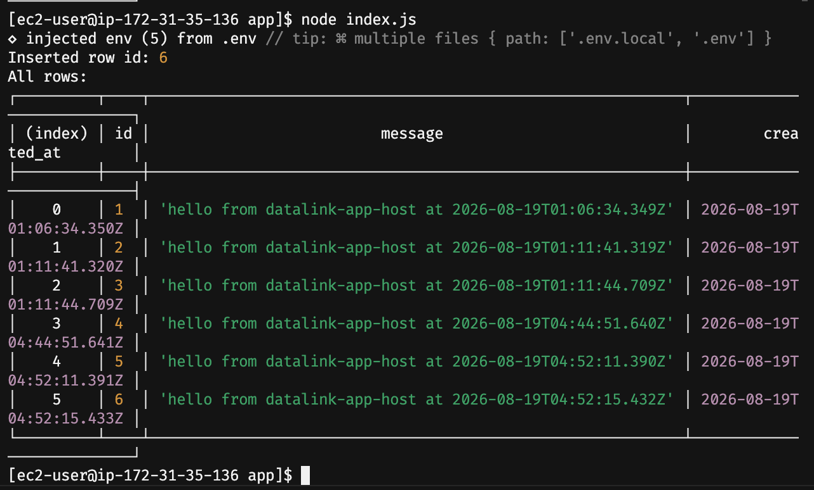
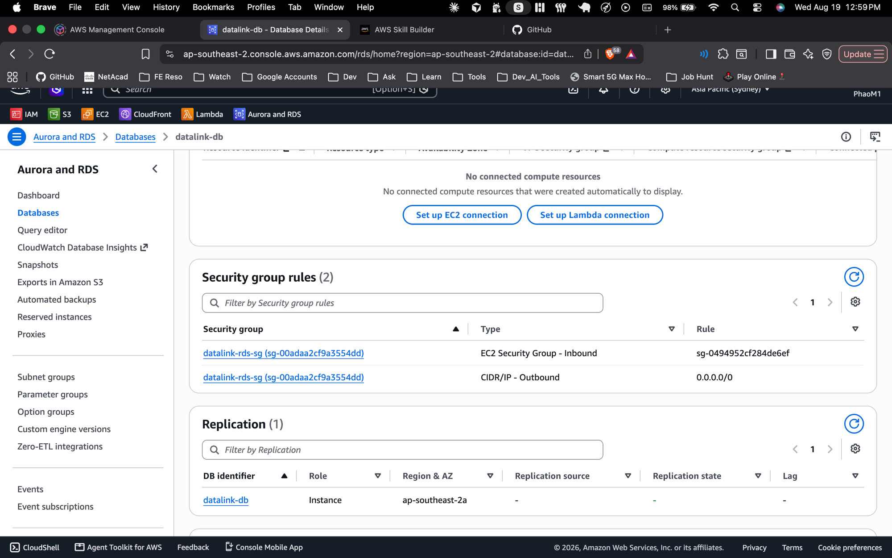

# DataLink

Track A demo #7 — RDS-connected app. A small Node.js script proves a
read + write against a free-tier RDS PostgreSQL instance, reachable
only through a security-group-gated path (no public DB access).

## What it does

`app/index.js` connects to RDS PostgreSQL from an EC2 "app host,"
creates a `visits` table if it doesn't exist, inserts one row, then
selects and prints every row in the table.

## Services used

- **Amazon RDS (PostgreSQL)** — `datalink-db`, db.t3.micro, Single-AZ,
  free tier, **not publicly accessible**
- **Amazon EC2** — `datalink-app-host`, t3.micro, Amazon Linux 2023,
  the only thing allowed to reach the DB
- **Security groups** — `datalink-app-sg` (SSH from my IP only) and
  `datalink-rds-sg` (Postgres 5432 from `datalink-app-sg` only, via
  SG-to-SG reference, not a CIDR) — full reasoning in
  [`context/architecture.md`](context/architecture.md)

## Architecture

```
Laptop --SSH(22, my IP only)--> EC2 app host --5432(SG-to-SG)--> RDS PostgreSQL
```

RDS has no public IP and no route from the internet. The only door in
is through the EC2 app host, and only your IP can SSH into that.

## Proof

**Script output** — insert + select running against RDS:



**RDS security group rules** — inbound only from the app host's SG,
no `0.0.0.0/0`:



## What was tricky

New AWS console UI dropped the old "Free tier" template button — first
attempt at RDS defaulted to an Aurora Serverless cluster (no free tier,
real hourly cost) and a second attempt defaulted to a Multi-AZ cluster
with provisioned IOPS estimated at $1744/month. Had to manually pick
every field (engine: PostgreSQL not Aurora, deployment: Single-AZ
1 instance, class: burstable t3.micro, storage: gp2 not Provisioned
IOPS) to land back on an actual free-tier-eligible config. Also caught
and fixed a `ssl: { rejectUnauthorized: false }` TLS issue post-build —
encrypted but not verifying the server's certificate — swapped in
AWS's RDS CA bundle instead.

## Teardown

Per project discipline, this gets torn down once the write-up above is
verified: RDS instance deleted, EC2 app host terminated, both security
groups removed, confirmed no orphaned Elastic IPs. See `TODO.md`.
